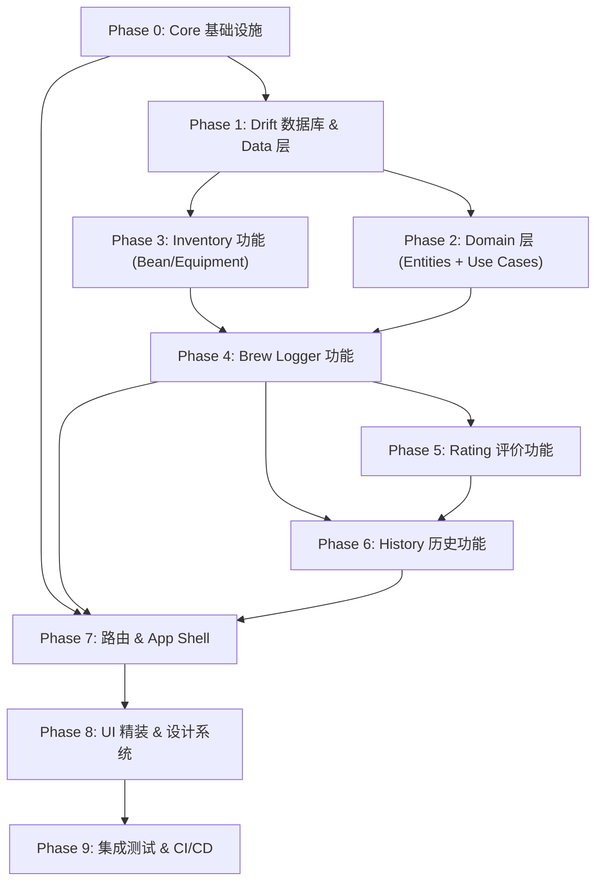

# OneCoffee 分阶段开发计划 (Phased Development Plan)

> **基于**: `01_Architecture.md` v1.1 · `00_Product_Brief.md` · `03_UI_Specification.md`
> **产出日期**: 2026-03-07 · **状态**: 待审阅

## 总体原则

1. **每阶段独立可验收** — 完成后可运行测试/构建验证，不依赖后续阶段
2. **自底向上** — 先基础设施，再 Data → Domain → Presentation，逐层堆叠
3. **Feature by Feature** — 功能模块按依赖关系排序（Inventory → Brew Logger → Rating → History）
4. **每阶段适合单次 AI 会话** — 范围控制在一场对话的 context window 以内

## 依赖关系总览



---

## Phase 0: Core 基础设施 (Constants, Theme, Utils, 通用 Widgets)

### 范围
搭建 `lib/core/` 目录下的所有基础模块，为后续所有功能提供共用的设计 Token 和工具函数。

### 交付物

| 文件 | 说明 |
|---|---|
| `lib/core/constants/app_colors.dart` | 基于 UI Spec 的色彩系统（背景、主色、辅色、文字色、高光/投影） |
| `lib/core/constants/app_text_styles.dart` | 字体排版系统（标题衬线体 + 正文无衬线体） |
| `lib/core/constants/app_spacing.dart` | 间距 & 尺寸 Token |
| `lib/core/constants/app_durations.dart` | 动画时长常量（150ms, 250ms 等） |
| `lib/core/theme/app_theme.dart` | ThemeData 组装（Light 主题） |
| `lib/core/theme/dark_theme.dart` | 暗色主题（预留，可最小实现） |
| `lib/core/utils/date_utils.dart` | 日期格式化工具 |
| `lib/core/utils/timer_utils.dart` | 计时器辅助函数 |
| `lib/core/utils/extensions.dart` | Dart 扩展方法 |
| `lib/core/widgets/app_card.dart` | 统一卡片组件（Neumorphism 风格） |
| `lib/core/widgets/app_slider.dart` | 自定义滑块组件 |
| `lib/core/widgets/app_chip_input.dart` | 标签输入组件 |
| `lib/core/widgets/app_timer_display.dart` | 计时器显示组件 |
| `lib/core/widgets/progressive_expand.dart` | 渐进式展开容器 |
| `lib/shared/helpers/brew_param_defaults.dart` | 默认参数预设值 |

### 验收标准
- [x] `flutter analyze` 无 error/warning
- [x] `flutter test test/core/` 通过（编写简单的 Widget/Unit Test 验证常量值、Theme 正确性）
- [x] 可在空 App 中导入使用，渲染一个使用 Theme + Card 的示例页面

### 推荐测试
```bash
flutter analyze
flutter test test/core/
```

---

## Phase 1: Drift 数据库 & Data 层

### 范围
建立 Drift 数据库定义和全部 Table 模型（BrewRecord, Bean, Equipment, BrewRating），运行 `build_runner` 生成代码，编写数据库 CRUD 测试。

### 交付物

| 文件 | 说明 |
|---|---|
| `lib/core/database/drift_database.dart` | Drift Database 主文件 (`@DriftDatabase` + 所有 Tables) |
| `lib/features/brew_logger/data/models/brew_record_model.dart` | BrewRecord Drift Table 定义 |
| `lib/features/inventory/data/models/bean_model.dart` | Bean Drift Table |
| `lib/features/inventory/data/models/equipment_model.dart` | Equipment Drift Table |
| `lib/features/rating/data/models/brew_rating_model.dart` | BrewRating Drift Table |
| `lib/shared/providers/database_providers.dart` | Drift Database 的 Riverpod Provider |
| `test/core/database/drift_database_test.dart` | 数据库集成测试（内存库 CRUD） |

### 验收标准
- [x] `dart run build_runner build` 成功生成 `.g.dart` 文件
- [x] `flutter test test/core/database/` 全部通过
- [x] CRUD（增删改查）对 4 张表均有覆盖
- [x] 外键关联（BrewRecord → Bean, BrewRecord → Equipment, BrewRating → BrewRecord）正确

### 推荐测试
```bash
dart run build_runner build --delete-conflicting-outputs
flutter test test/core/database/
```

---

## Phase 2: Domain 层 (Entities + Use Cases + Repository Interfaces)

### 范围
定义纯 Dart 的 Domain 层实体（使用 freezed）、Repository 接口、以及 Use Case 类。此层完全不依赖 Flutter 和 Drift。

### 交付物

| 模块 | 文件 | 说明 |
|---|---|---|
| **brew_logger** | `domain/entities/brew_record.dart` | BrewRecord 实体（freezed） |
| | `domain/repositories/brew_repository.dart` | Repository 接口 |
| | `domain/usecases/create_brew_record.dart` | 创建冲煮记录 |
| | `domain/usecases/update_brew_record.dart` | 更新记录 |
| | `domain/usecases/delete_brew_record.dart` | 删除记录 |
| **inventory** | `domain/entities/bean.dart` | Bean 实体 |
| | `domain/entities/equipment.dart` | Equipment 实体 |
| | `domain/repositories/inventory_repository.dart` | Repository 接口 |
| | `domain/usecases/get_suggestions.dart` | 智能下拉补全 |
| | `domain/usecases/create_bean.dart` | 创建 Bean |
| | `domain/usecases/create_equipment.dart` | 创建 Equipment |
| **rating** | `domain/entities/brew_rating.dart` | BrewRating 实体 |
| | `domain/usecases/save_rating.dart` | 保存评价 |
| **history** | `domain/entities/brew_summary.dart` | 聚合视图实体 |
| | `domain/repositories/history_repository.dart` | Repository 接口 |
| | `domain/usecases/get_brew_history.dart` | 获取历史 |
| | `domain/usecases/filter_brews.dart` | 按条件筛选 |
| | `domain/usecases/get_top_brews.dart` | 高分冲煮 |
| **shared** | `test/helpers/test_fixtures.dart` | 测试数据工厂 |
| | `test/helpers/mock_repositories.dart` | Mock 仓库（mockito） |

### 验收标准
- [x] `dart run build_runner build` 生成 freezed + mockito 代码成功
- [x] Use Case 单元测试（使用 Mock Repository）全部通过
- [x] Domain 层无任何对 Flutter SDK / Drift 的 import 依赖
- [x] `flutter test test/features/*/domain/` 通过

### 推荐测试
```bash
dart run build_runner build --delete-conflicting-outputs
flutter test test/features/brew_logger/domain/
flutter test test/features/inventory/domain/
flutter test test/features/rating/domain/
flutter test test/features/history/domain/
```

---

## Phase 3: Inventory 功能完整实现 (Data + Presentation)

### 范围
完成 Inventory 模块的 Data 层实现（Repository Impl + LocalDataSource）和 Presentation 层（Controller + Widgets），实现 Bean/Equipment 的自动入库和智能补全。

### 前置依赖
- Phase 1 (数据库)
- Phase 2 (Inventory Domain 层)

### 交付物

| 文件                                                   | 说明                  |
| ---------------------------------------------------- | ------------------- |
| `data/datasources/inventory_local_datasource.dart`   | Drift 数据源           |
| `data/repositories/inventory_repository_impl.dart`   | Repository 实现       |
| `presentation/controllers/inventory_controller.dart` | Riverpod Controller |
| `presentation/widgets/smart_tag_field.dart`          | 自动补全标签输入            |
| `presentation/widgets/template_picker.dart`          | "再冲一次"模板选择          |
| `test/.../inventory_repository_impl_test.dart`       | Repository 实现测试     |

### 验收标准
- [x] Bean/Equipment 增删改查 + useCount 更新逻辑测试通过
- [x] 智能补全（按 useCount 排序 + 模糊匹配）逻辑测试通过
- [x] `flutter test test/features/inventory/` 全部通过
- [x] Widget Test 验证 `smart_tag_field` 渲染与交互

### 推荐测试
```bash
flutter test test/features/inventory/
```

---

## Phase 4: Brew Logger 功能完整实现 (Data + Presentation)

### 范围
完成冲煮记录器的 Data 层实现和完整 Presentation 层，包括计时器、参数输入区（渐进展开）、以及与 Inventory 模块的联动。

### 前置依赖
- Phase 1 (数据库)
- Phase 2 (Brew Logger Domain 层)
- Phase 3 (Inventory — 用于 Bean/Equipment 选择联动)

### 交付物

| 文件 | 说明 |
|---|---|
| `data/datasources/brew_local_datasource.dart` | Drift 数据源 |
| `data/repositories/brew_repository_impl.dart` | Repository 实现 |
| `presentation/pages/brew_logger_page.dart` | 记录器主页面 |
| `presentation/widgets/brew_timer_widget.dart` | 正/倒计时器 |
| `presentation/widgets/param_input_section.dart` | 参数输入区 |
| `presentation/widgets/quick_params_bar.dart` | 必备参数快捷条 |
| `presentation/widgets/advanced_params_panel.dart` | 高级参数面板 |
| `presentation/controllers/brew_logger_controller.dart` | 页面状态 |
| `presentation/controllers/brew_timer_controller.dart` | 计时器状态 |
| `test/.../brew_repository_impl_test.dart` | Repository 测试 |
| `test/.../brew_logger_page_test.dart` | Widget Test |
| `test/.../brew_timer_controller_test.dart` | 计时器逻辑测试 |

### 验收标准
- [x] BrewRecord CRUD + 研磨度三模式逻辑测试通过
- [x] 计时器控制器（启动/暂停/重置/后台恢复）单元测试通过
- [x] `brew_logger_page` Widget Test：页面渲染、按钮交互、极简/专业模式切换
- [x] `flutter test test/features/brew_logger/` 全部通过
- [x] 单独运行页面可正常录入一条完整冲煮记录

### 推荐测试
```bash
flutter test test/features/brew_logger/
```

---

## Phase 5: Rating 评价功能完整实现

### 范围
完成分层风味评价体系的 Data 层和 Presentation 层，包括快速评分（星级/表情）和专业评分（风味轮/酸甜苦滑块）。

### 前置依赖
- Phase 1 (数据库)
- Phase 2 (Rating Domain 层)
- Phase 4 (Brew Logger — 评价关联到 BrewRecord)

### 交付物

| 文件 | 说明 |
|---|---|
| `data/datasources/rating_local_datasource.dart` | Drift 数据源 |
| `presentation/widgets/quick_rating_bar.dart` | 滑动星级/表情组件 |
| `presentation/widgets/flavor_wheel.dart` | 风味轮组件 |
| `presentation/widgets/flavor_sliders.dart` | 酸甜苦分离滑块 |
| `presentation/controllers/rating_controller.dart` | 评价状态管理 |
| `test/.../quick_rating_bar_test.dart` | Widget Test |

### 验收标准
- [x] 评价 CRUD 逻辑测试通过（快速模式 + 专业模式）
- [x] quickScore 1-5 范围校验、emoji 选择
- [x] `quick_rating_bar` Widget Test：滑动交互、渲染断言
- [x] `flutter test test/features/rating/` 全部通过

### 推荐测试
```bash
flutter test test/features/rating/
```

---

## Phase 6: History 历史功能完整实现

### 范围
完成冲煮历史的 Data 层和 Presentation 层，包括历史列表、筛选机制、高分高亮，以及统计摘要。

### 前置依赖
- Phase 1 (数据库)
- Phase 2 (History Domain 层)
- Phase 4 (Brew Logger — 历史数据来源)
- Phase 5 (Rating — 评分筛选和高亮)

### 交付物

| 文件 | 说明 |
|---|---|
| `data/datasources/history_local_datasource.dart` | Drift 数据源（含聚合查询） |
| `data/repositories/history_repository_impl.dart` | Repository 实现 |
| `presentation/pages/history_page.dart` | 历史数据墙 |
| `presentation/widgets/brew_record_card.dart` | 记录卡片（高分高亮） |
| `presentation/widgets/history_filter_bar.dart` | 筛选栏 |
| `presentation/widgets/brew_stats_header.dart` | 统计摘要头部 |
| `presentation/controllers/history_controller.dart` | 历史页状态 |
| `test/.../get_brew_history_test.dart` | Use Case 测试 |

### 验收标准
- [x] 按豆种/评分/日期范围筛选逻辑测试通过
- [x] 高分冲煮排名查询测试通过
- [x] `history_page` Widget Test：列表渲染、筛选交互
- [x] `flutter test test/features/history/` 全部通过

### 推荐测试
```bash
flutter test test/features/history/
```

---

## Phase 7: 路由 & App Shell (GoRouter + 导航)

### 范围
组装 GoRouter 路由表、AppShell（底部导航）、以及 `app.dart` 入口配置，将所有功能页面串联成完整的可导航 App。

### 前置依赖
- Phase 0 (Theme)
- Phase 4 (Brew Logger Page)
- Phase 6 (History Page)

### 交付物

| 文件 | 说明 |
|---|---|
| `lib/core/router/app_router.dart` | GoRouter 路由表 |
| `lib/app.dart` | MaterialApp.router 配置 |
| `lib/main.dart` | 入口更新（ProviderScope 包裹） |

### 验收标准
- [ ] 应用可正常启动，首页直达冲煮记录器
- [ ] 底部导航切换 Brew / History 页面无异常
- [ ] `flutter run` 成功启动 App（不 crash）
- [ ] `flutter analyze` 无 error

### 推荐测试
```bash
flutter analyze
# 手动验证：flutter run -> 检查页面切换
```

---

## Phase 8: UI 精装 & 设计系统落地

### 范围
基于 `03_UI_Specification.md`，对所有已完成的页面和组件进行 Neumorphism 风格精装：凹凸光影、按压反馈、微动画、底部弹窗交互优化。

### 前置依赖
- Phase 0 ~ Phase 7 全部完成

### 交付物
- 更新 `app_theme.dart` / `app_colors.dart` — 精调色值、阴影参数
- 为所有 `app_card`, `app_slider` 等通用组件实现 Neumorphism 凹凸效果
- 为按钮添加 OnTapDown → InnerShadow 按压反馈
- 计时器表盘 Neumorphic Dial 效果
- 底部弹窗驱动表单（替换全屏跳转）
- 动画时序调优（150ms-250ms + Spring Physics）

### 验收标准
- [ ] `flutter analyze` 无 error
- [ ] 对照 UI Spec 的色彩、排版、交互约束逐项检查
- [ ] Widget Test 验证关键组件渲染（光影参数不暴力检查，但保证无异常）
- [ ] 手动验证：应用内各页面视觉与 Spec 一致

### 推荐测试
```bash
flutter analyze
flutter test
# 手动验证 UI 效果
```

---

## Phase 9: 集成测试 & CI/CD

### 范围
编写集成测试、配置 GitHub Actions CI 流水线，满足 OKR 中的所有可验证指标。

### 前置依赖
- Phase 0 ~ Phase 8 全部完成

### 交付物

| 文件 | 说明 |
|---|---|
| `integration_test/app_cold_start_test.dart` | OKR: 冷启动 ≤2 次点击到计时器 |
| `integration_test/brew_flow_test.dart` | 完整冲煮流程测试 |
| `integration_test/timer_background_test.dart` | 后台挂起计时异常测试 |
| `integration_test/progressive_expand_test.dart` | 极简/专业模式展开测试 |
| `.github/workflows/ci.yml` | CI Pipeline：Analyze → Test → Build APK |
| `scripts/build_apk.sh` | 构建 APK 脚本 |

### 验收标准
- [ ] 4 个集成测试全部通过 (`flutter test integration_test/`)
- [ ] CI Pipeline 推送后自动触发：Analyze → Unit Test → Widget Test → Build APK
- [ ] `flutter build apk --release` 无 Error，成功产出 APK
- [ ] OKR Checklist 全部满足

### 推荐测试
```bash
flutter test integration_test/
flutter build apk --release
```

---

## 开发会话规划建议

> [!TIP]
> 每个 Phase 建议开始一个**新的 AI 对话会话**，在每次会话中应当：
> 1. 引用本计划文档 + 架构文档作为上下文
> 2. 明确告知当前执行的 Phase 编号
> 3. 完成后运行该 Phase 的验收测试命令
> 4. 确认通过后，标记该 Phase 为 ✅

> [!IMPORTANT]
> **Phase 合并建议**：如果某些 Phase 内容较少，可以与前一个 Phase 合并在同一会话中完成：
> - Phase 0 + Phase 1 可合并（基础设施 + 数据库，总量适中）
> - Phase 2 + Phase 3 可合并（Domain 层 + Inventory 实现）
> - Phase 5 较轻量，可与 Phase 4 合并
> - Phase 7 较轻量，可与 Phase 6 合并

## 总体进度追踪

| Phase | 名称 | 状态 | 估计工作量 |
|---|---|---|---|
| 0 | Core 基础设施 | ✅ 已完成 | 中 |
| 1 | Drift 数据库 & Data 层 | ✅ 已完成 | 中 |
| 2 | Domain 层 | ✅ 已完成 | 中 |
| 3 | Inventory 功能 | ✅ 已完成 | 中 |
| 4 | Brew Logger 功能 | ✅ 已完成 | 大 |
| 5 | Rating 评价功能 | ✅ 已完成 | 中 |
| 6 | History 历史功能 | ✅ 已完成 | 中 |
| 7 | 路由 & App Shell | ⬜ 未开始 | 小 |
| 8 | UI 精装 & 设计系统 | ⬜ 未开始 | 大 |
| 9 | 集成测试 & CI/CD | ⬜ 未开始 | 中 |
